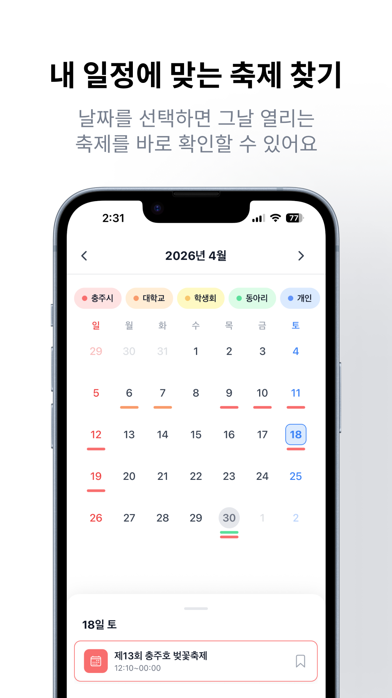
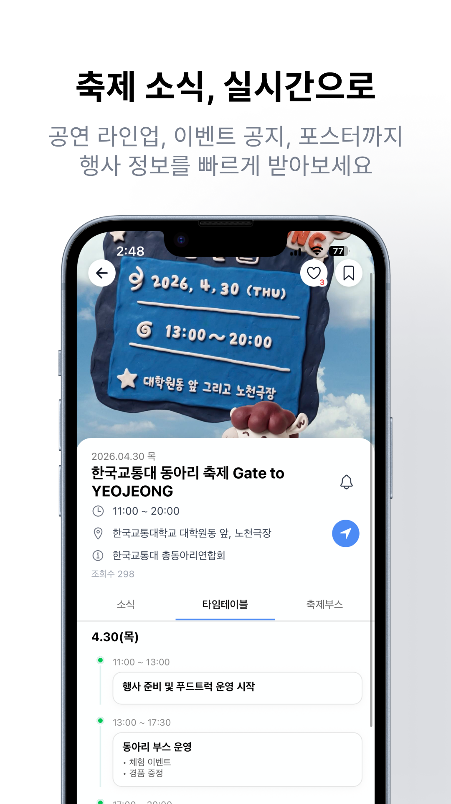
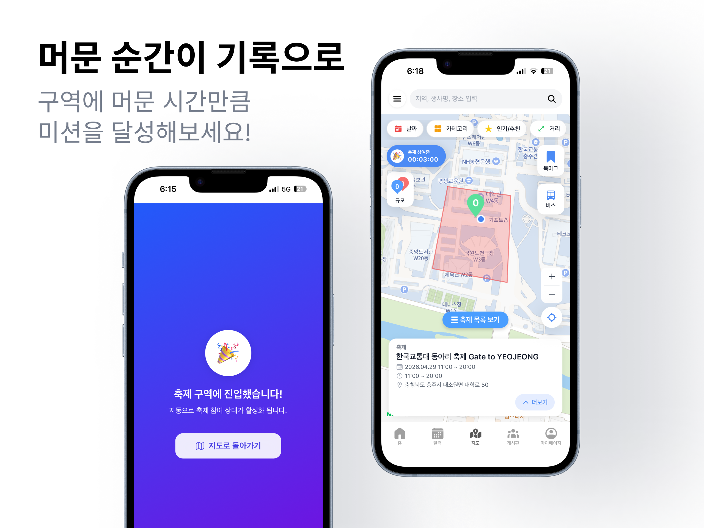
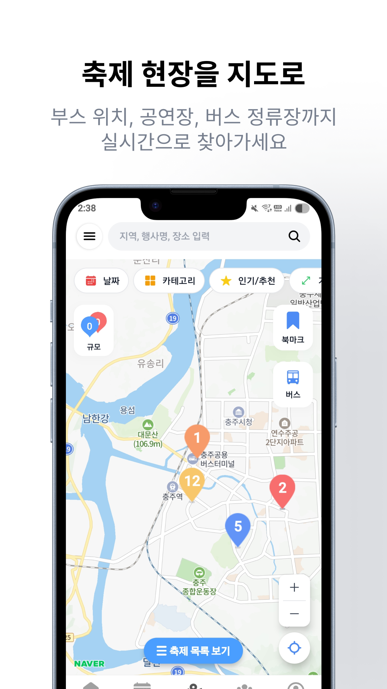

<div align="center">


# Dailo

### 대학 축제를 지도와 커뮤니티로 탐색하고, 현장 참여를 연결하는 위치 기반 서비스

<p><a href="#주요-기능">주요 기능</a> · <a href="#기술-스택">기술 스택</a> · <a href="#실행-방법">실행 방법</a></p>

</div>

---

## 프로젝트 소개

Dailo는 대학 축제 정보를 한곳에서 확인하고, 지도·일정·커뮤니티를 통해 축제를 더 편리하게 즐길 수 있도록 만든 위치 기반 축제 플랫폼입니다.

축제 현장에서는 **Geofencing**과 **Foreground Service**를 활용해 사용자의 체류를 인증하고, 미션 완료 알림과 설문을 통해 실제 사용 데이터를 수집합니다.

> 창업 동아리 지원 사업의 일환으로 개발한 실제 서비스형 프로젝트로, 위치 인식 정확도·서버 부하·배터리 효율을 현장에서 검증했습니다.

## 주요 기능

| 기능 | 설명 |
| --- | --- |
| 축제 탐색 | 지역·행사명·날짜·카테고리별 축제 검색 및 필터링 |
| 지도 기반 탐색 | 축제 위치, 행사 구역, 부스와 주변 정보를 지도에서 확인 |
| 일정·상세 정보 | 행사 일정, 공연 라인업, 공지, 포스터 등 상세 정보 제공 |
| 체류 인증 미션 | 축제 구역 내 체류 여부를 확인하고 미션 참여 상태 관리 |
| 실시간 알림 | 백그라운드에서도 Foreground Service와 알림으로 미션 진행 상황 안내 |
| 커뮤니티 | 게시글·댓글·대댓글, 신고·차단 기능 제공 |
| 설문·피드백 | 미션 완료 후 베타 테스터의 사용 경험과 개선 의견 수집 |

## 서비스 화면

<div align="center">
  
  
  
  
  
</div>

## 사용자 시나리오

```text
축제 구역 진입 → 위치 확인 및 이벤트 활성화 → 체류 시간 측정
→ 미션 완료 알림 → 설문 참여 및 피드백 수집
```

## 기술 스택

### Mobile

`SwiftUI` `iOS` `Core Location` `UserNotifications`

### Backend

`Java 17` `Spring Boot` `Spring Data JPA` `Spring Security` `JWT` `MySQL`

### Infrastructure & External Services

`AWS S3` `Firebase FCM` `Docker` `Terraform` `GitHub Actions` `Swagger`

## 기술적으로 검증한 내용

- Geofencing 기반 축제 구역 진입·이탈 감지
- 앱이 백그라운드로 전환되어도 동작하는 Foreground Service
- Sticky Notification을 활용한 실시간 미션 카운트다운
- 미션 시작·종료 및 체류 결과의 서버 저장
- 실제 환경에서 위치 인식 정확도, 서버 부하, 배터리 효율 검증

## 실행 방법

### Backend

```bash
cd backend
./gradlew bootRun
```

### Frontend

```bash
cd frontend
npm install
npm run dev
```

### Admin Web

```bash
cd admin-web
npm install
npm run dev
```

> 각 실행 환경에 필요한 API 키와 데이터베이스 설정은 프로젝트 환경에 맞게 구성해야 합니다.

## 프로젝트 구조

```text
.
├── Dailo/       # iOS 앱
├── frontend/    # 사용자 웹/앱 연동 화면
├── backend/     # Spring Boot API 서버
├── admin-web/   # 관리자 웹
├── ai/          # 데이터 및 AI 관련 모듈
├── infra/       # Terraform·부하 테스트 등 인프라 구성
└── docs/        # 프로젝트 문서 및 서비스 이미지
```

## 기대 효과

1. 축제 정보를 여러 채널에서 찾는 불편을 줄입니다.
2. 현장 체류 기반 미션으로 자연스러운 사용자 참여를 유도합니다.
3. 실제 사용 데이터를 바탕으로 위치 기반 서비스의 완성도를 높입니다.

## License

This project is for educational and service validation purposes.
